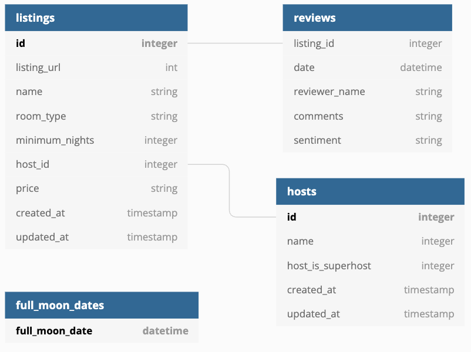

Welcome to your new dbt project!

### Using the starter project

Try running the following commands:
- dbt run
- dbt test

### Resources:
- Learn more about dbt [in the docs](https://docs.getdbt.com/docs/introduction)
- Check out [Discourse](https://discourse.getdbt.com/) for commonly asked questions and answers
- Join the [chat](https://community.getdbt.com/) on Slack for live discussions and support
- Find [dbt events](https://events.getdbt.com) near you
- Check out [the blog](https://blog.getdbt.com/) for the latest news on dbt's development and best practices

In order to override the overview page we need to create overview.md file under models.
then wecan create a public s3 bucket and put the file there. give permissions for public access and the use the https://--- (file url) in overview.md file to see it in documentation

eg:  Here is the schema of our input data :

if you do not want to put the file in s3, you may create assets folder, provide asset-paths in dbt_project and use it in overview.md

dbt run-operation learnvariables
dbt run-operation learnvariables --vars {"user_name":"Arpan"}